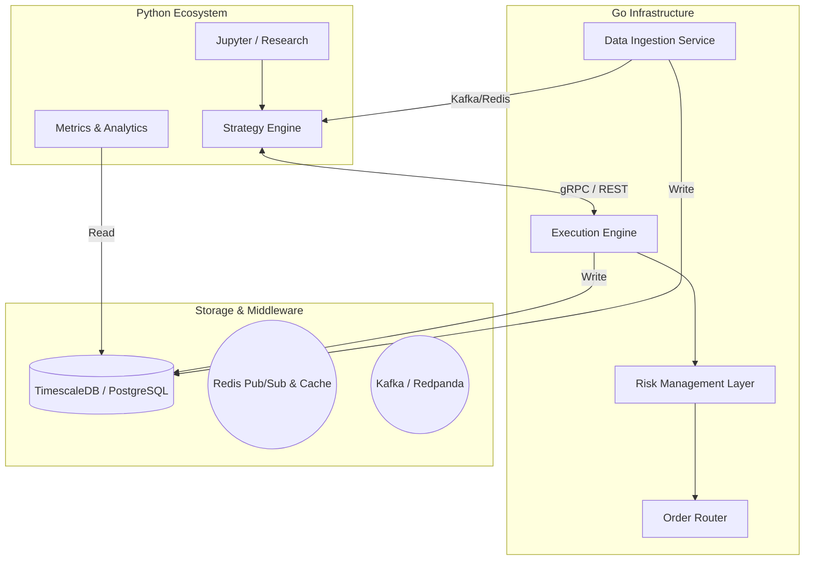
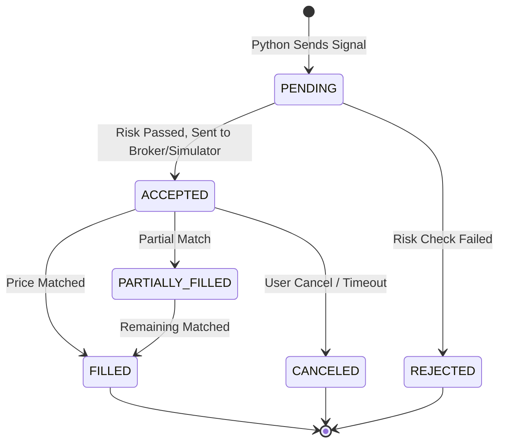
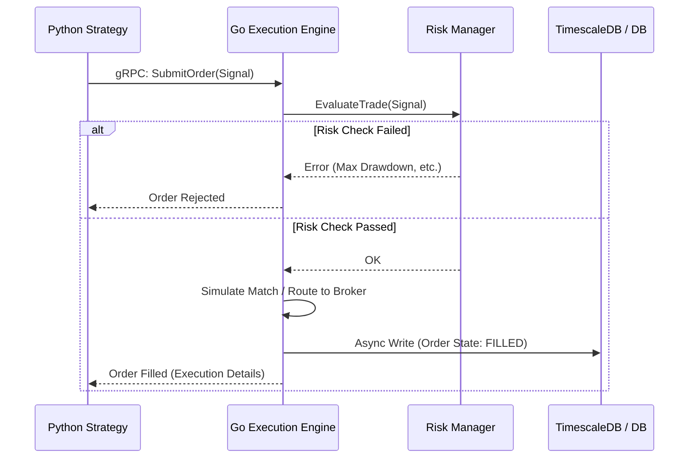

# StratForge Trading Architecture

## 1. Executive Summary

StratForge is a production-grade, hybrid quantitative research and execution simulation engine. It leverages the strengths of **Python** for data science, machine learning, and strategy logic, and **Go** for high-performance, low-latency concurrent systems, market data processing, and execution simulation.

The platform is designed to provide a seamless transition from backtesting to live paper-trading (and eventually live execution) with minimal code changes, ensuring that simulated results accurately reflect real-world execution conditions.

---

## 2. High-Level Design (HLD)

### 2.1 System Context & Actors

The system operates across three primary phases: **Research & Backtesting**, **Paper Trading**, and **Live Execution**.

*   **Quantitative Researcher (Actor):** Uses Jupyter Notebooks and the Python SDK to design, backtest, and optimize strategies.
*   **Data Providers (External):** Sources of historical and real-time market data (e.g., Binance, Alpaca, Polygon).
*   **Brokers / Exchanges (External):** Venues for order execution.

### 2.2 Container Architecture (C4 Level 2)



### 2.3 Inter-Process Communication (IPC)

Given the polyglot nature of StratForge, robust IPC is critical:

*   **Real-time Streaming:** Market data ticks and order book updates are streamed from Go to Python via **Redis Pub/Sub** (for low-latency, transient data) or **Kafka** (for guaranteed delivery and replayability).
*   **Command & Control:** Python sends trade signals (e.g., BUY/SELL) to the Go Execution Engine via **gRPC**. gRPC provides strict schema validation (Protobuf) and low-latency RPC.
*   **State Sync:** Order status updates (e.g., PENDING -> FILLED) are pushed back to Python via callbacks or Redis event streams.

### 2.4 Fault Tolerance & Reliability

*   **Stateless Services:** The Go Execution Engine and Risk Manager are designed as stateless services (relying on Redis for distributed locking/state) to allow horizontal scaling.
*   **Idempotent Order Handling:** All order requests carry unique idempotency keys to prevent duplicate executions during network partitions.
*   **Circuit Breakers:** The Risk Management Layer implements circuit breakers (e.g., halting trading if max drawdown is breached or if exchange latency exceeds thresholds).

---

## 3. Low-Level Design (LLD)

### 3.1 Data Models & Schemas

Data persistence uses **TimescaleDB** (PostgreSQL extension optimized for time-series data).

*   **Market Data (Candles/Ticks):**
    ```sql
    CREATE TABLE market_data (
        time TIMESTAMPTZ NOT NULL,
        symbol VARCHAR(20) NOT NULL,
        open DOUBLE PRECISION,
        high DOUBLE PRECISION,
        low DOUBLE PRECISION,
        close DOUBLE PRECISION,
        volume DOUBLE PRECISION
    );
    SELECT create_hypertable('market_data', 'time');
    ```

*   **Order State Model:**
    ```json
    {
      "order_id": "uuid",
      "timestamp": "iso8601",
      "symbol": "BTC/USD",
      "side": "BUY",
      "type": "LIMIT",
      "quantity": 1.5,
      "price": 65000.0,
      "status": "FILLED" // PENDING, ACCEPTED, FILLED, REJECTED, CANCELED
    }
    ```

### 3.2 State Machines

The **Order State Machine** is strictly enforced within the Go Execution layer:



### 3.3 Core Interfaces (Go)

```go
// ExecutionEngine defines the core routing and execution logic
type ExecutionEngine interface {
    SubmitOrder(ctx context.Context, order models.Order) (models.OrderResponse, error)
    CancelOrder(ctx context.Context, orderID string) error
    GetOrderStatus(orderID string) (models.OrderStatus, error)
}

// RiskManager evaluates trades before execution
type RiskManager interface {
    EvaluateTrade(portfolio PortfolioState, order models.Order) error
}

// DataStreamer handles market data ingestion
type DataStreamer interface {
    Subscribe(symbols []string) (<-chan models.Tick, error)
}
```

### 3.4 Concurrency Models (Go)

The Go layer leverages goroutines and channels to achieve ultra-low latency:
*   **Ingestion Workers:** Dedicated goroutines maintain persistent WebSocket connections to exchanges.
*   **Matching Engine (Simulator):** Order matching uses highly optimized lock-free queues or buffered channels.
*   **Worker Pools:** Risk checks and database writes are offloaded to bounded worker pools to prevent unbounded memory growth.

### 3.5 Sequence Diagram: Order Execution Flow



---

## 4. Technology Stack & Infrastructure

### 4.1 Core Stack
*   **Research / Logic:** Python 3.11+, Pandas, NumPy, Scikit-Learn.
*   **Systems / Execution:** Go 1.21+.
*   **Database:** TimescaleDB (Time-series), PostgreSQL (Relational metadata).
*   **Caching & State:** Redis (Order state cache, Pub/Sub).
*   **Message Broker:** Kafka or Redpanda (Event streaming, ingestion pipeline).
*   **RPC Framework:** gRPC / Protocol Buffers.

### 4.2 Deployment Architecture

*   **Local Development:** `docker-compose.yml` defining TimescaleDB, Redis, and local instances of the Python and Go engines.
*   **Production Deployment:** Kubernetes (K8s).
    *   Stateless Go pods behind a LoadBalancer.
    *   StatefulSets for databases.
    *   Helm charts for configuration management.

---

## 5. Extensibility & Plugin Systems

StratForge is built to be extensible:
*   **Broker Plugins (Go):** Adding a new broker (e.g., Interactive Brokers, Binance) only requires implementing the `ExecutionEngine` Go interface.
*   **Strategy Plugins (Python):** Strategies inherit from a base `Strategy` class, enforcing standard `on_tick()`, `on_bar()`, and `on_order_update()` lifecycle methods.
*   **Metrics Plugins (Python):** Custom risk and performance metrics can be plugged into the reporting pipeline without altering the core backtest loop.
